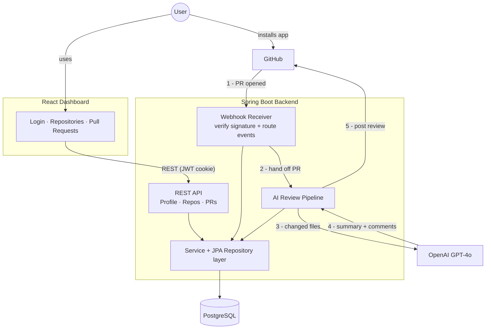

# SmartMerge 🤖

**An AI-powered GitHub App that automatically reviews pull requests.** When a developer opens a PR on a connected repository, SmartMerge fetches the changed files, sends them to an LLM for analysis, and posts a full code review back to GitHub — a summary of the changes plus inline comments pinned to the exact lines they refer to. A React dashboard lets users track every repository and pull request the app has reviewed.

Built with **Java / Spring Boot**, **React**, **PostgreSQL**, and the **OpenAI API** (via Spring AI).

---

## What it does

1. **Sign in with GitHub** — users log into the dashboard using GitHub OAuth.
2. **Install the app on repositories** — one click opens GitHub's install flow; the user picks which repos SmartMerge can access.
3. **Automatic PR reviews** — when a pull request is opened on a connected repo, GitHub notifies the backend via webhook. The backend fetches the PR's changed files, asks the AI for a review, and posts it back to the PR: a summary comment plus inline comments on specific lines.
4. **Track everything in the dashboard** — repositories and their pull requests are stored in Postgres and shown in the dashboard, with each PR's status tracked through its lifecycle: `OPEN → REVIEWED → MERGED / CLOSED`.

<p align="center">
  
  <br><em>The SmartMerge dashboard — your connected repositories and the review status of every pull request.</em>
</p>

---

## Architecture



```
frontend/   React 19 + Vite SPA (react-router, styled-components, axios)
backend/    Spring Boot 3.5 REST API (Java 17, Maven)
```

**Backend layers** (`backend/src/main/java/com/smartmerge/`):

| Package | Responsibility |
|---|---|
| `controller/` | REST endpoints: auth, profile, repos, pull requests, GitHub webhook receiver |
| `security/` | OAuth2 login, JWT creation/validation, per-request auth filter, CORS |
| `handler/` | Webhook event handlers (installation created/deleted, repos added/removed, PRs opened/closed) |
| `util/` | The review pipeline: GitHub API client, app token service, PR file collection, OpenAI service, review poster |
| `service/` + `repository/` | Business logic and Spring Data JPA persistence |
| `model/` | Entities: `Account`, `Profile`, `Installation`, `Repo`, `PullRequest` |

**Entity relationships:** an `Account` (GitHub user) has an `Installation` of the app; an installation covers many `Repo`s; each repo has many `PullRequest`s. Deleting an installation cascades through its repos and PRs in a single transaction.

<p align="center">
  
</p>

**Why `Account` and `Profile` are separate:** they're the same user, split by concern. `Account` is the login identity — it carries the email and is loaded as the security principal to authenticate every request, so it stays server-side. `Profile` is just the public display data (username, avatar) that the dashboard reads from `/profile`; because it has no email field, that response can never leak the user's email to the browser.

---

## How a review happens

1. **Webhook arrives.** GitHub sends a `pull_request.opened` event to the backend. Before anything is parsed, the request's **HMAC-SHA256 signature is verified** against the raw request body using the webhook secret — forged or tampered payloads are rejected with a 401. The comparison is constant-time (`MessageDigest.isEqual`) to prevent timing attacks.

2. **The backend authenticates as the app.** To call the GitHub API on the user's behalf, the backend signs a short-lived **RS256 JWT** with the GitHub App's private key and exchanges it for an installation access token. (GitHub ships the key in PKCS#1 format, which Java can't read natively — it's converted to PKCS#8 with BouncyCastle first.)

3. **Changed files are collected.** For every file in the PR, the backend fetches the diff patch and the full file contents. Each line of the contents is prefixed with its line number (`12: <code>`) before being sent to the model — so the AI reads line numbers directly instead of counting them, which LLMs are unreliable at.

4. **One AI call produces the whole review.** A single chat request (Spring AI `ChatClient` → GPT-4o) returns both the summary and the inline comments. Inline comments come back in a simple line-based text protocol:

   ```
   INLINE_COMMENT: <file path> | <line number> | <comment>
   ```

   This parses with a plain line reader and degrades gracefully — one malformed comment line doesn't break the rest of the review.

5. **The review is posted to GitHub** through the create-review API, with each inline comment anchored to its file and line. The PR's database record is updated to `REVIEWED`, and later webhook events flip it to `MERGED` or `CLOSED`.

### Example: a review on a real PR

<p align="center">
  
  <br><em>The summary comment SmartMerge posts when a PR is opened — an overview of the changes plus a code review.</em>
</p>

<p align="center">
  
  <br><em>Inline comments land on the exact lines they reference — including the caught <code>total = n</code> → <code>total += n</code> bug.</em>
</p>

---

## Security design

- **Webhook signature verification** — every GitHub delivery is authenticated with HMAC-SHA256 over the raw body, compared in constant time. Unsigned or tampered requests never reach business logic.
- **Stateless JWT auth in an HttpOnly cookie** — after OAuth login, the backend mints an HS256 JWT (subject = the user's immutable GitHub ID) and stores it in an `HttpOnly` cookie, so tokens are never exposed to JavaScript (XSS protection). No server-side sessions.
- **Ownership checks on every data endpoint (IDOR defense)** — a user requesting repos or PRs by ID gets a 403 unless the records actually belong to them; IDs from the URL are never trusted.
- **Secrets externalized** — API keys, client secrets, the webhook secret, and the signing key live in an uncommitted `application-secrets.yml`, never in code.
- **Centralized error handling** — a global exception handler maps errors to clean JSON responses (404/403/401/500) so internal details and stack traces are never leaked to clients.

---

## Tech stack

| Layer | Technology |
|---|---|
| Backend | Java 17, Spring Boot 3.5 (Web, Security, Data JPA, OAuth2 Client, Validation, Actuator) |
| AI | Spring AI `ChatClient` → OpenAI GPT-4o |
| Auth | GitHub OAuth2 login + custom JWT (jjwt), GitHub App JWT (RS256, BouncyCastle) |
| Database | PostgreSQL (Hibernate/JPA); H2 for tests |
| Frontend | React 19, Vite, React Router 7, styled-components, axios |
| GitHub integration | GitHub App + webhooks, REST API via Spring `RestClient` |

---

## Interesting engineering problems

**Getting inline comments onto the right lines.** This was the hardest part. GitHub's old `position` field wants an offset into the diff, and the AI kept miscalculating it, so comments landed on the wrong lines. Switching to the `line` + `side` fields (a plain line number) helped but didn't fix it — the model was still counting lines, and still getting it wrong. What finally worked was numbering every line of the file in the prompt, so the AI reads the number off the code instead of counting to it. Moving that mechanical work out of the model was the fix.

**One generic GitHub client instead of five.** The GitHub calls started out copy-pasted across every class that talked to GitHub, each with its own client and headers. I pulled them into one `GithubServiceCaller` with two generic methods — `get` and `post`, taking a `ParameterizedTypeReference<T>` — so a single method handles every response shape (`List<Map>`, `Map`, or nothing at all). Adding something like GitHub's required `User-Agent` header became a one-line change instead of five.

**Two kinds of GitHub identity.** Logging a *user* into the dashboard and acting as a *bot* on their repos are two separate GitHub systems — an OAuth App and a GitHub App — with three kinds of token between them (user OAuth tokens, app JWTs, installation tokens), each proving something different. Keeping those straight while running them all through one shared HTTP client drove a lot of the backend's design.

**Webhook payload quirks.** Jackson boxes JSON numbers as `Integer` or `Long` depending on how big they are — which I found out the hard way when a cast blew up at runtime. Every GitHub ID now goes through `Number` to dodge `ClassCastException`s, and they're all stored as `long`, since GitHub's ids overflow `int`.

---

## Running locally

**Prerequisites:** Java 17, Node 20.19+ (or 22.12+, required by Vite 8), Docker (for Postgres), a [GitHub OAuth App](https://docs.github.com/en/apps/oauth-apps) (dashboard login), a [GitHub App](https://docs.github.com/en/apps) (webhooks + repo access), and an OpenAI API key.

**1. Start Postgres**

```bash
docker run --name smartmerge-db \
  -e POSTGRES_PASSWORD=postgres -e POSTGRES_USER=postgres -e POSTGRES_DB=smartmerge \
  -p 5432:5432 -d postgres:15
```

**2. Configure secrets** — create `backend/src/main/resources/application-secrets.yml` (gitignored) with your GitHub OAuth client ID/secret, GitHub App ID and private-key path, webhook secret, JWT signing key, database credentials, and OpenAI API key.

**3. Start the backend** (port 8081)

```bash
cd backend && ./mvnw spring-boot:run
```

**4. Start the frontend** (port 5173) — create `frontend/.env` (gitignored) pointing at the backend, then install and run:

```bash
cd frontend
echo "VITE_API_URL=http://localhost:8081" > .env
npm install && npm run dev
```

**5. Relay webhooks** — GitHub can't reach `localhost`, so forward webhook deliveries through a [smee.io](https://smee.io) channel:

```bash
npx smee-client --url https://smee.io/YOUR_CHANNEL --target http://localhost:8081/api/v1/webhook/github
```

Then log in at `http://localhost:5173`, install the app on a repo from the dashboard, and open a pull request — the review appears on GitHub within moments.

---

## API overview

| Method | Endpoint | Description |
|---|---|---|
| `POST` | `/api/v1/webhook/github` | GitHub webhook receiver (HMAC-verified) |
| `GET` | `/api/v1/profile` | Authenticated user's profile |
| `GET` | `/api/v1/repository/user/{userId}` | User's connected repositories (ownership-checked) |
| `GET` | `/api/v1/pull-requests/repository/{repoId}` | PRs for a repository (ownership-checked) |
| `POST` | `/api/v1/auth/logout` | Clears the auth cookie |
